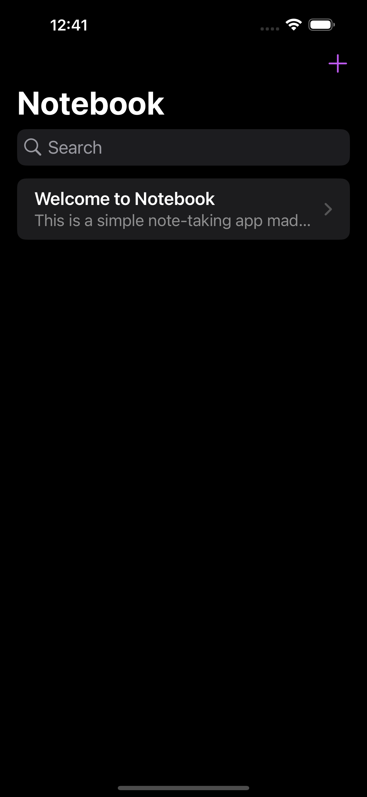
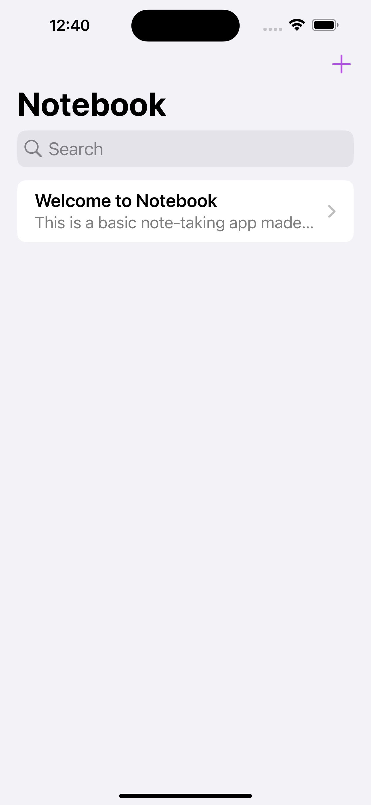

## Notebook
A simple note-taking app made using SwiftUI and SwiftData

### Screenshots
  
### Features
- **Persistent Notes** - Save and manage notes locally with SwiftData.
- **Minimal UI** - Minimal, native iOS UI.
- **SwiftUI Design** - Utilizes modern SwiftUI layout

### Technology Used
- **Swift** - Core language
- **SwiftUI** - UI framework
- **SwiftData** - For data persistence

### How to Run
1. Clone the repository.
```
git clone https://github.com/DTeakell/Notebook.git
```
2. Open in Xcode.
3. Build and run on an iPhone simulator or physical device.

### Requirements
- **Xcode 15 +**
- **iOS 16 +**
